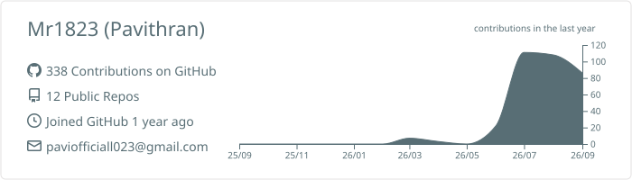

<h1 align="center">Hi, I'm Pavithran 👋</h1>
<h3 align="center">B.Tech AI & Data Science Student | Building AI-Native Products | Targeting Zoho</h3>

  

---

### About Me

- 🎓 **B.Tech AI & Data Science** @ Kamaraj College of Engineering & Technology (KCET), Virudhunagar — Batch 2024–2028
- 🏫 Affiliated with **Anna University** | Student ID: 24UAD056
- 🔭 Currently building: **RageRadar** — an AI-native B2B SaaS platform that scores brand sentiment with a "Rage Index," as part of **Straw Labs Genesis Cohort 01**
- 💼 Interned at **Lamda Tech Softics**
- 🎯 Targeting: **Software Developer role at Zoho**
- 🌱 Currently sharpening: **DSA** (90-day "Curious Freaks" tracker) and the AI/ML ecosystem
- 🧘 Grounded in Stoic philosophy — I build things that mean something, not just things that demo well
- 📍 Tamil Nadu, India

---

### Tech Stack

**Languages**

  
  
  

**Frontend & Mobile**

  
  
  
  

**Backend & Data**

  
  
  
  
  

**AI / ML**

  
  
  
  

**Tools**

  
  

---

### Featured Projects

| Project | Description | Tech Stack |
|---|---|---|
| 🔥 **RageRadar** | B2B SaaS platform that aggregates frustrated customer reviews (Reddit, App Store, Google Play, YouTube, news) and scores brands with a 0–100 "Rage Index," backed by a full AI intelligence layer (query planner, emotion engine, LLM insights, chat interface) | React, Node.js, Supabase, HuggingFace, Claude |
| 🎨 **AirPlay** | Real-time, gesture-controlled virtual drawing system with a webcam pipeline, mini-game puzzle mode, and Flask-based web streaming | Python, OpenCV, Flask |
| 💰 **Kanakku Pulla** | Android personal finance tracker for Tamil college students — SMS auto-parsing, NPCI-based deduplication, GPay-style dialpad, multi-bank support | Java, Android, Room DB |
| 🧘 **Marcus AI** | Fully local, offline AI companion running on-device with a custom Stoic-inspired persona and long-term memory | Python, Ollama, Flask, SQLite |

---

### Certifications

- **18 Anthropic Certifications**
- **Cisco Networking Academy** — Introduction to Modern AI, Data Analytics Essentials, Apply AI: Analyze Customer Reviews
- **Microsoft AI Skills Fest**

---

### GitHub Stats

<!-- After running the profile-summary-cards Action once, replace the two paths below
     with the actual filenames from profile-summary-card-output/default/ in your repo. -->

  
  

---

### Connect

  
  

